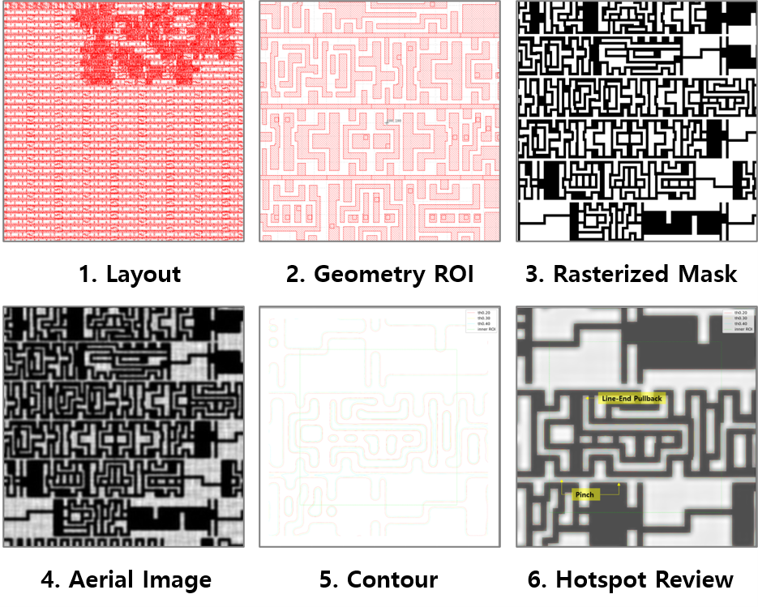
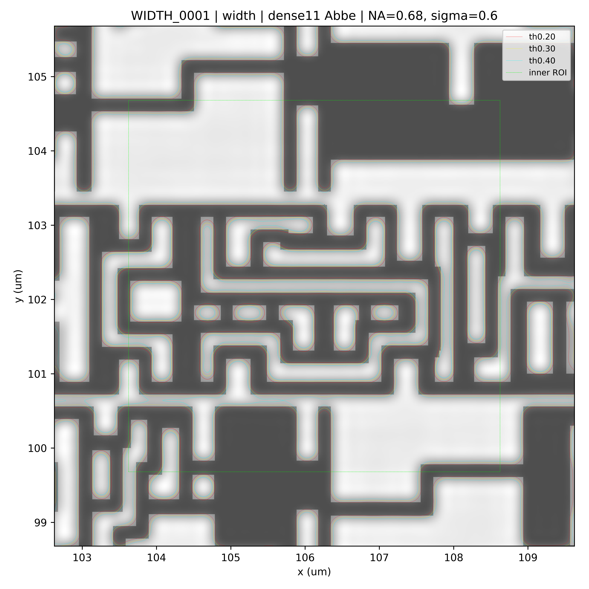
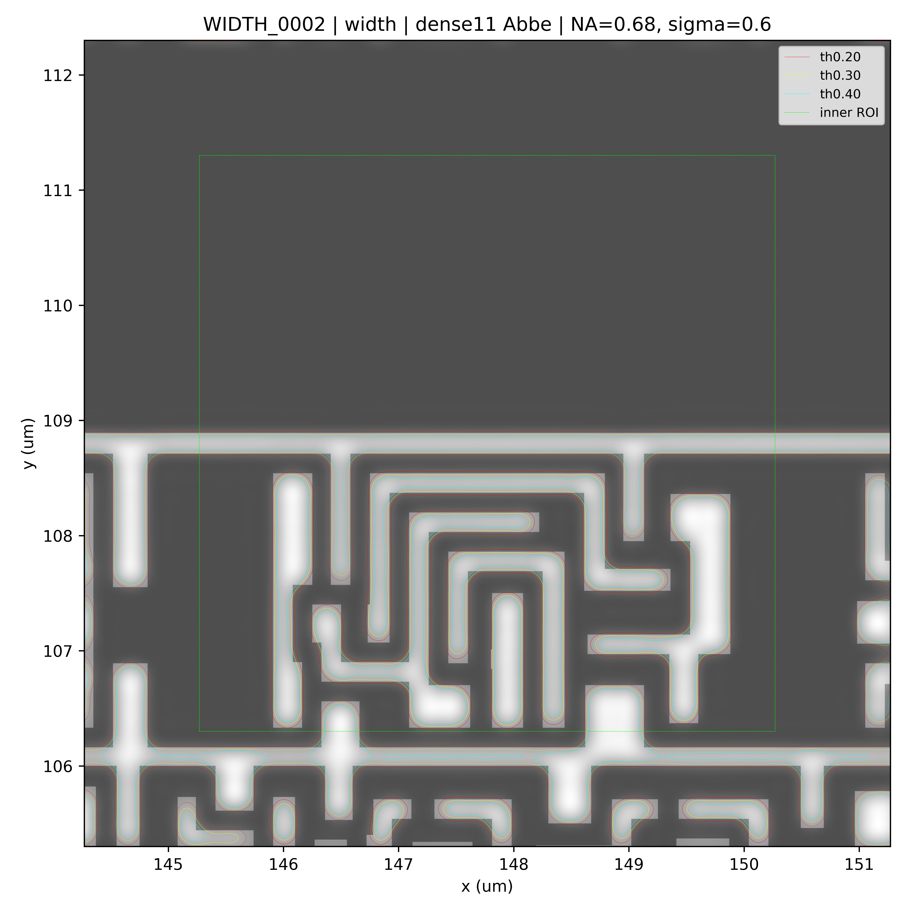
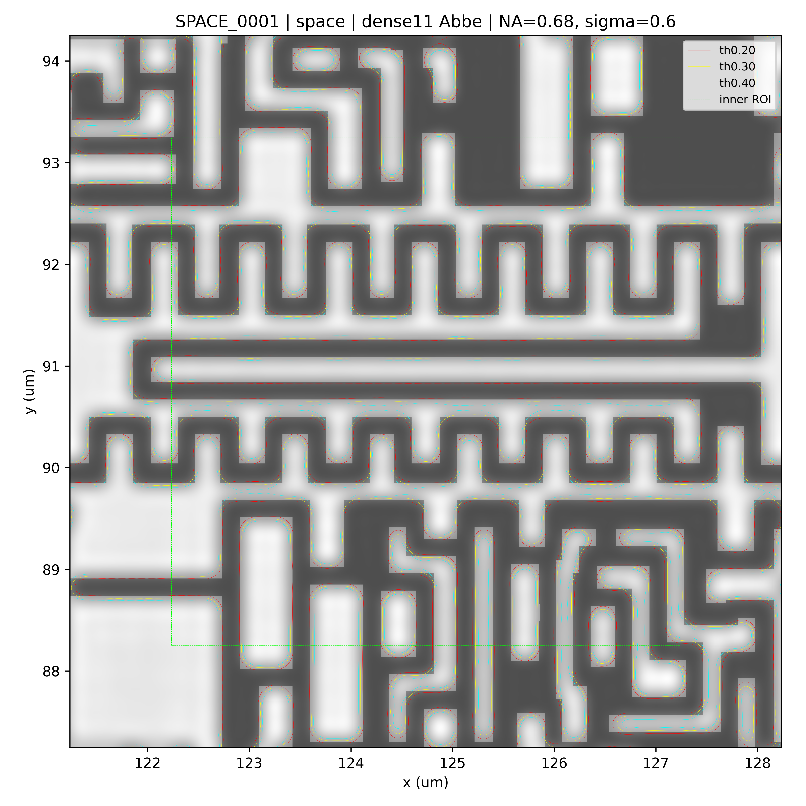
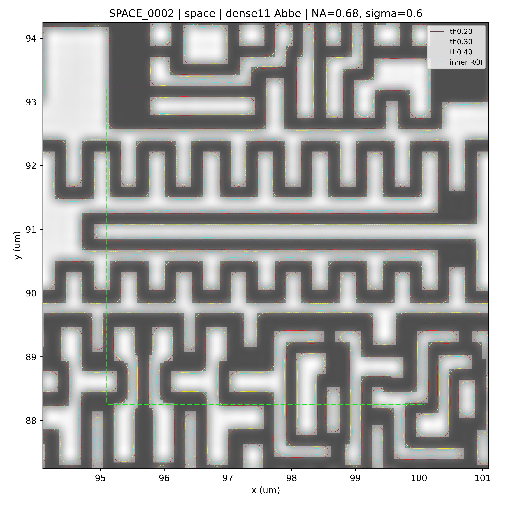

[English]({{ site.baseurl }}/demo/) | [한국어]({{ site.baseurl }}/ko/demo/)

# Demo


## 1. Demo Overview

This page summarizes representative demo results for **GeoSignal Preview**.

GeoSignal Preview starts by identifying candidate regions from layout geometry, then generates a rasterized mask, a simplified Abbe-based aerial image, and multi-threshold contours for selected regions. The final goal is to visually review hotspot-like shapes that may deserve additional lithography-aware inspection.

The purpose of this demo is not to provide accurate process prediction or an optimized hotspot detector.

Instead, this demo focuses on the following two-step review flow.

```text
Step 1: Geometry-based candidate filtering
Step 2: Optical-response and contour-behavior review for selected ROIs
```

The key question is:

> If a region is first suspected from a minimum width / space viewpoint, can we further review whether that region also looks meaningful from an optical-response and threshold-contour viewpoint?

The basic demo flow is:

```text
Layout Geometry
    → Geometry-based Candidate Filtering
    → ROI Selection
    → Rasterized Mask
    → Abbe-based Aerial Image
    → Multi-threshold Contour
    → Hotspot-like Shape Review
```



The workflow can be understood in two parts.

The first part is **geometry-based candidate filtering**.

```text
Layout Geometry
    → Width / Space screening
    → Candidate ROI selection
```

The second part is **optical contour review for the selected ROI**.

```text
Candidate ROI
    → Rasterized Mask
    → Aerial Image
    → Multi-threshold Contour
    → Hotspot-like Shape Review
```

This demo does not run optical simulation on every layout region. Instead, it first narrows down regions that may deserve higher review priority based on layout geometry, then applies optical-model-based contour review to a limited number of ROIs.

This approach is intended as a lightweight preview workflow for quickly identifying lithography-aware review points while keeping computation manageable.

---

## 2. Candidate Selection Policy in This Demo

In this demo, candidate regions are first identified from a minimum width / space viewpoint. A small number of ROIs are then selected for aerial-image and contour generation.

The representative candidates were prepared as follows.

```text
1. Extract regions where width or space is 0.200 µm or below.
2. Separate width-related and space-related candidates.
3. Select two width candidates and two space candidates, considering runtime.
4. Generate aerial images and multi-threshold contours for the selected four ROIs.
```

The `0.200 µm` criterion is not a process rule or a calibrated hotspot threshold. It is a preview criterion used under the assumption that a minimum width / space value is already known and that regions near this value are worth reviewing first.

The current candidate selection is also not an optimized hotspot-ranking logic. Selecting larger candidate regions first was a pragmatic choice for constructing this demo, not a validated prioritization rule.

Therefore, the current candidate selection should be understood as follows.

```text
Final hotspot decision logic
    X

Preview-stage geometry-based filtering
    O
```

The important point of this demo is not the specific `0.200 µm` value or the temporary ranking method. The important point is the workflow.

```text
Find potentially weak locations from layout geometry
→ Calculate optical response at those locations
→ Review shape changes through threshold contours
```

In future work, the candidate selection logic can be improved by considering not only width / space, but also contour mismatch, local pattern context, line-end behavior, corner behavior, neighboring density, and contact / via overlay relationships.

---

## 3. What This Demo Shows

This demo reviews the following items.

| Item                      | Description                                                                                   |
| ------------------------- | --------------------------------------------------------------------------------------------- |
| Geometry-based Candidate  | Candidate region first selected from minimum width / space in the layout                      |
| ROI Selection             | Selected review region within the current runtime budget                                      |
| Rasterized Mask           | Binary mask generated by rasterizing layout polygons onto a pixel grid                        |
| Aerial Image              | Optical intensity map calculated using a simplified Abbe-based imaging model                  |
| Multi-threshold Contour   | Contours extracted at threshold levels 0.20 / 0.30 / 0.40                                     |
| Hotspot-like Shape Review | Visual review of necking, pinch, corner rounding, line-end pullback, and bridge-like behavior |

The key comparison is:

```text
geometry-based candidate
    vs
aerial-image-based optical response
    vs
threshold-contour-based printed-shape-like behavior
```

The threshold contours used in this demo are not calibrated resist contours. They are qualitative visualization references for observing how the aerial image appears as contour behavior under different threshold levels.

---

## 4. Representative Candidate Results

The current demo shows four representative candidate ROIs.

```text
WIDTH_0001
WIDTH_0002
SPACE_0001
SPACE_0002
```

These four candidates are preview examples selected from width / space based candidates while considering runtime. Each candidate should be interpreted using the same common review viewpoint rather than as a separate final judgment.

Each image shows the following information.

```text
aerial image
+ multi-threshold contours
+ ROI marker
+ hotspot-like shape annotation
```

The images below do not mean that the selected candidates will necessarily fail in a real process. They are preview results for checking how optical response and contour behavior appear in regions first selected by width / space criteria in the layout.

### Width Candidate 0001



### Width Candidate 0002



### Space Candidate 0001



### Space Candidate 0002



---

## 5. Common Interpretation Points

Although the four images show different ROIs, they should be reviewed using the same interpretation viewpoint.

The main points to check are:

* whether edge blur or intensity spreading appears in the aerial image
* whether line-end pullback-like behavior appears near line ends
* whether corner rounding-like behavior appears around corners
* whether necking or pinch-like behavior appears around narrow-width regions
* whether bridge-like behavior may appear around narrow-space regions
* how much the 0.20 / 0.30 / 0.40 threshold contours move
* whether large contour movement aligns with the geometry-based candidate region
* whether the shape could become more important when contact / via overlay or another layer relationship is considered
* whether the region may be worth reviewing later for mask correction or mask optimization

The philosophy of this demo is not to make a final hotspot judgment. It is to help reviewers quickly narrow down locations that deserve attention.

GeoSignal Preview is intended as a lightweight review tool with the following direction.

```text
Extract geometry-based candidates
    → Review optical response
    → Review contour behavior
    → Prioritize locations with possible process risk
    → Connect to mask correction or additional simulation if needed
```

---

## 6. Recommended Reading Flow

The recommended reading order is:

1. First, check the overall workflow in the pipeline image.
2. Understand that candidate ROIs are first selected based on width / space in the layout.
3. Treat the current `0.200 µm` criterion and candidate selection method as preview-stage heuristics.
4. Check how the aerial image is formed in the selected ROI.
5. Check how the 0.20 / 0.30 / 0.40 threshold contours move.
6. Look for necking, pinch, corner rounding, line-end pullback, or bridge-like behavior.
7. Decide whether the location may be meaningful for future mask optimization or additional lithography-aware review.

The key questions are:

```text
Which location is first suspected from a geometry viewpoint?
Does the same location also look weak or unstable in optical response?
Where is the threshold-contour movement relatively large?
Could this location become a process-risk area when combined with contact / via overlay or another layer condition?
Is it worth reviewing later for mask correction or additional simulation?
```

---

## 7. Current Scope and Limitations

The current demo is a qualitative visualization result for public preview.

It has the following limitations.

* The `0.200 µm` width / space criterion is an arbitrary demo criterion.
* The candidate selection method is not an optimized hotspot-ranking logic.
* Only two width candidates and two space candidates are shown due to runtime considerations.
* A simplified Abbe-based imaging model is used.
* Wafer-data-based calibration is not included.
* Resist and etch models are not included.
* Threshold contours are used for qualitative comparison and visualization.
* CD prediction accuracy is not the goal.
* Public or synthetic examples are used.
* Core implementation code is not included in this public preview repository.

Therefore, the current results should be interpreted as:

```text
qualitative visual indicators
```

not as:

```text
production specifications
```

In short, this demo shows how geometry-only review can be extended toward optical contour-based lithography-aware review. It is not intended to predict exact process results.

---

## 8. Future Work

Future improvements may include the following directions.

| Item                           | Direction                                                                                                 |
| ------------------------------ | --------------------------------------------------------------------------------------------------------- |
| Candidate selection            | Consider pattern context, line-end, corner, density, and neighboring features beyond simple width / space |
| Ranking logic                  | Use contour sensitivity, mask-contour mismatch, and local contrast instead of simple area-based ordering  |
| Runtime improvement            | Improve computation efficiency for wider layout regions                                                   |
| Accuracy / imaging improvement | Refine source modeling, use more source points, and review TCC-based computation for efficiency           |
| Mask optimization              | Review simple mask correction or rule-based adjustment based on contour results                           |
| Layer-aware review             | Consider contact / via overlay and metal / gate relationships                                             |
| Additional examples            | Add dense line-space, isolated line-end, narrow gap, and corner pattern cases                             |

The current demo is an early step toward these directions.

For now, the main question is:

> Can we first identify suspicious locations from geometry and then quickly review them from an optical contour viewpoint?

---

## 9. Feedback Points

Feedback is especially helpful for the following points.

* whether multi-threshold contour helps understand contour sensitivity
* whether hotspot-like shape observation is intuitive
* whether observing necking, corner rounding, line-end pullback, and bridge-like behavior is useful
* whether a future connection to mask correction or mask optimization would be necessary
* which direction is more important between runtime improvement and accuracy improvement
* what additional pattern cases would make the preview clearer

Even short comments, questions, or first impressions are useful.

---

## 10. Related Pages

* [Home](./)
* [Method](method.md)
* [Technical Notes](notes/)

