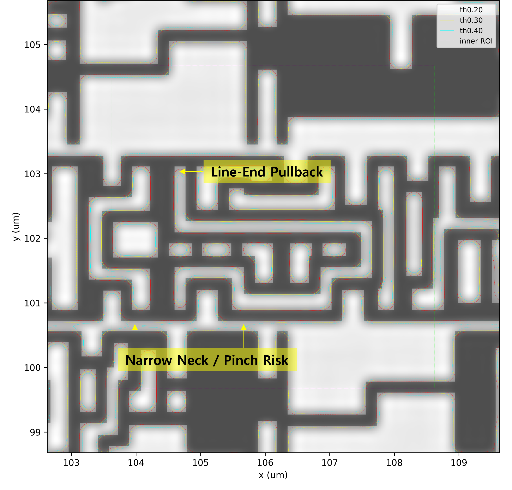

---

layout: default
title: GeoSignal Preview
description: GeoSignal Preview 한국어 소개
permalink: /ko/
---

[English]({{ site.baseurl }}/) | [한국어]({{ site.baseurl }}/ko/)

# GeoSignal Preview

GeoSignal Preview는 GDS layout을 기반으로 geometry signal과 simplified aerial image / contour를 함께 확인하기 위한 **lithography-aware layout visualization preview**입니다.



## 1. GeoSignal Preview란?

**GeoSignal Preview**는 public GDS 또는 synthetic layout example을 기반으로, layout geometry가 simplified optical model을 거쳤을 때 어떤 optical response로 나타나는지 시각적으로 확인하기 위한 기술 데모입니다.

핵심 흐름은 다음과 같습니다.

```text
layout geometry
    → rasterized mask
    → simplified aerial image
    → threshold contour
    → hotspot candidate visualization
```

이 페이지는 GeoSignal Preview의 전체 workflow를 소개하고, demo result, method explanation, technical notes로 이동하기 위한 landing page입니다.

목표는 정밀한 공정 예측이 아닙니다. 대신 GeoSignal Preview는 다음 핵심 질문을 직관적으로 검토하는 데 초점을 둡니다.

> geometry 기준으로는 단순해 보이는 pattern이 optical response 관점에서는 어떻게 보이는가?

특히 edge rounding-like response, line-end pullback-like response, necking-like response, bridge-like response, 그리고 mask geometry와 threshold contour 사이의 차이를 시각적으로 관찰하는 데 중점을 둡니다.

---

## 2. 문제의식

Minimum width, minimum space, density와 같은 geometry 기반 분석은 layout pattern을 이해하는 데 유용합니다. 하지만 geometry check만으로는 특정 pattern이 optical imaging 관점에서 어떻게 변형되어 보일지 직관적으로 파악하기 어려운 경우가 있습니다.

GeoSignal Preview는 이 간극을 줄이기 위해 layout polygon을 binary mask image로 변환하고, simplified optical model을 이용해 aerial image를 생성한 뒤, threshold contour를 추출하여 geometry 기반 candidate와 optical response를 ROI 단위로 비교합니다.

이를 통해 layout geometry와 optical response 사이의 관계를 이미지 중심으로 빠르게 확인할 수 있습니다.

---

## 3. Preview 구성

GeoSignal Preview는 다음 페이지로 구성되어 있습니다.

| Page                        | 내용                             |
| --------------------------- | ------------------------------ |
| [Demo](./demo.md)           | Demo image와 결과 해석              |
| [Method](./method.md)       | Simplified method와 workflow 설명 |
| [Technical Notes](./notes/) | 관련 technical notes             |

### Demo

Demo 페이지에서는 public 또는 synthetic layout example을 기준으로 mask image, aerial image, threshold contour overlay 결과를 확인할 수 있습니다.

주요 확인 항목은 다음과 같습니다.

* mask image
* aerial image
* mask + aerial image overlay
* mask + aerial image + contour overlay
* threshold 비교
* hotspot candidate ROI visualization

### Method

Method 페이지에서는 GeoSignal Preview의 계산 흐름을 설명합니다.

주요 내용은 다음과 같습니다.

* candidate ROI selection
* polygon rasterization
* binary mask generation
* simplified Abbe-based imaging
* source point sampling
* pupil filtering
* threshold contour extraction
* mask와 contour 비교 방식
* hotspot candidate review

### Technical Notes

Technical Notes에는 demo와 method를 이해하는 데 필요한 보조 설명을 정리합니다.

예를 들어 다음과 같은 내용을 다룹니다.

* aerial image와 threshold contour의 기본 해석
* source sampling과 optical parameter의 정성적 영향
* geometry candidate와 optical response 비교 관점
* Fourier optics와 Abbe imaging 배경

---

## 4. Demo에서 확인할 수 있는 것

GeoSignal Preview의 demo는 production-level accuracy를 주장하기 위한 것이 아닙니다. 대신 simplified optical model을 거친 후 layout pattern이 어떻게 다르게 보일 수 있는지를 직관적으로 보여주는 데 목적이 있습니다.

Demo를 통해 다음 질문을 검토할 수 있습니다.

* geometry 기준으로는 문제가 작아 보이는 pattern이 optical response에서는 상대적으로 민감하게 보이는가?
* threshold contour에서 edge rounding, necking, bridge-like response와 같은 패턴 변화가 관찰되는가?
* geometry-based candidate와 optical-response-based candidate가 같은 위치를 가리키는가?
* threshold 비교가 contour sensitivity를 이해하는 데 도움이 되는가?
* 어떤 시각화 방식이 layout risk를 이해하는 데 가장 도움이 되는가?

Demo는 calibrated lithography verification result가 아니라 qualitative review workflow로 이해하는 것이 적절합니다.

---

## 5. Method Overview

GeoSignal Preview의 기본 workflow는 다음과 같습니다.

```text
1. Load layout example
2. Select region of interest
3. Rasterize layout polygon into binary mask
4. Generate aerial image using simplified optical model
5. Extract threshold contours from aerial image
6. Overlay mask, aerial image, and contour
7. Compare threshold-dependent contour behavior
8. Review hotspot candidate behavior
```

현재 preview는 simplified Abbe-based imaging model을 기반으로 합니다. 계산에는 wavelength, numerical aperture, pupil function, source point sampling, threshold level, pixel size, ROI size 등이 포함됩니다.

조명 조건은 여러 source point를 샘플링하여 근사하며, 현재 demo에서는 결과의 직관성과 계산량 사이의 균형을 고려한 조건을 사용합니다.

더 자세한 내용은 [Method](./method.md) 페이지에서 확인할 수 있습니다.

---

## 6. 해석 기준과 한계

GeoSignal Preview의 결과는 정성적 시각화와 상대 비교를 위한 것입니다.

따라서 결과는 정답이나 production specification이 아니라, layout geometry와 optical response 사이의 관계를 이해하기 위한 **visual analysis aid**로 해석하는 것이 적절합니다.

현재 preview의 주요 가정과 한계는 다음과 같습니다.

* public 또는 synthetic layout example을 사용합니다.
* simplified optical model을 사용합니다.
* wafer data 기반 calibration은 포함하지 않습니다.
* resist / etch model은 포함하지 않습니다.
* threshold contour는 정성적 비교와 시각화를 위한 기준입니다.
* 결과는 quantitative CD prediction이 아니라 qualitative indicator로 해석하는 것이 적절합니다.
* core implementation code는 이 public preview repository에 포함하지 않습니다.

---

## 7. 활용 목적

GeoSignal Preview는 public GDS 또는 synthetic pattern을 기반으로 lithography-aware layout behavior를 가볍게 확인하기 위한 visual analysis aid입니다.

특히 대학 연구실, 학생 프로젝트, 교육 목적의 연구자, 또는 고가의 상용 simulation 환경을 바로 사용하기 어려운 소규모 기술팀이 초기 연구, 학습, 정성적 비교 목적으로 참고할 수 있습니다.

주요 활용 목적은 다음과 같습니다.

* computational lithography 학습
* layout geometry와 optical response 관계 이해
* public 또는 synthetic pattern 기반 demo 확인
* aerial image와 threshold contour 기반 시각화 검토
* geometry check와 optical model 사이의 연결 구조 이해
* hotspot candidate visualization 아이디어 검토

---

## 8. 피드백

GeoSignal Preview는 현재 early public preview 단계입니다.

피드백, 질문, 제안이 있다면 어떤 내용이든 편하게 feedback form을 통해 남겨주세요.

특히 다음과 같은 의견이 도움이 됩니다.

* demo에서 이해하기 쉬웠던 부분 또는 어려웠던 부분
* mask / aerial image / contour comparison이 유용하게 느껴졌는지
* threshold 비교가 contour sensitivity와 layout risk 이해에 도움이 되는지
* 이러한 lithography-aware hotspot review 방식이 실제 업무 또는 연구 관점에서 의미 있어 보이는지
* 설명이 더 필요한 method 항목이 있는지
* 어떤 추가 layout example이 있으면 preview가 더 명확해질지

짧은 의견, 질문, 첫인상 수준의 코멘트도 모두 환영합니다.

---

## 9. Data and Example Policy

GeoSignal Preview는 public dataset, synthetic pattern, open-source layout example을 기준으로 구성합니다.

분석 workflow는 Python 기반 오픈소스 라이브러리를 활용해 구현되었으며, 공개 가능한 예제와 결과 해석을 중심으로 정리합니다.

Core implementation code는 이 public preview repository에 포함하지 않습니다.

---

## Keywords

`Lithography` · `Layout Analysis` · `GDS` · `Aerial Image` · `Threshold Contour` · `Hotspot Candidate` · `Python` · `gdstk` · `Computational Lithography`
