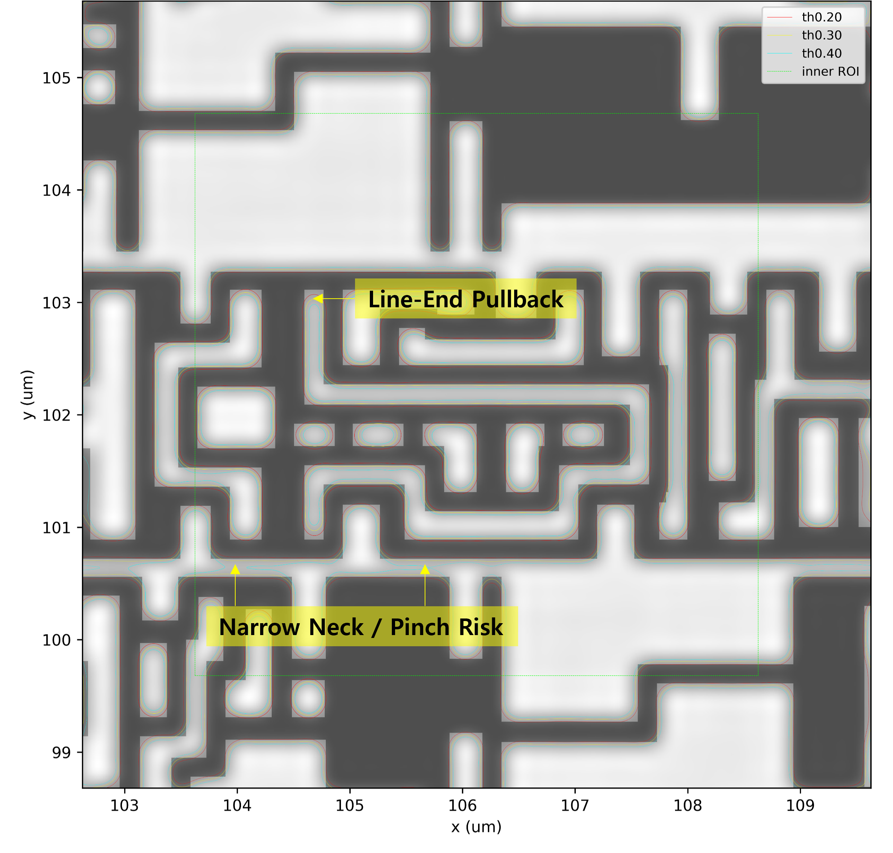

[English]({{ site.baseurl }}/) | [한국어]({{ site.baseurl }}/ko/)

# GeoSignal Preview

GeoSignal Preview는 GDS layout을 기반으로 geometry signal과 simplified aerial image / contour를 함께 확인하기 위한 **lithography-aware layout visualization preview**입니다.





## 1. GeoSignal Preview란?

**GeoSignal Preview**는 public GDS 또는 synthetic layout example을 기반으로, layout geometry가 simplified optical model을 거쳤을 때 어떤 optical response로 나타나는지 시각적으로 확인하기 위한 공개 데모입니다.

핵심 흐름은 다음과 같습니다.

```text
layout geometry
    -> rasterized mask
    -> simplified aerial image
    -> threshold contour
    -> hotspot-like review
```

목표는 정밀한 공정 예측이 아닙니다. 대신 다음 질문을 직관적으로 검토하는 데 초점을 둡니다.

> geometry 기준으로는 단순해 보이는 pattern이 optical response 관점에서는 어떻게 보이는가?

---

## 2. 문제의식

Minimum width, minimum space, density와 같은 geometry 기반 분석은 layout pattern을 이해하는 데 유용합니다. 하지만 geometry check만으로는 특정 pattern이 optical imaging 관점에서 어떻게 변형되어 보일지 직관적으로 파악하기 어려운 경우가 있습니다.

GeoSignal Preview는 layout polygon을 binary mask image로 변환하고, simplified optical model을 이용해 aerial image를 생성한 뒤, threshold contour를 추출하여 geometry 기반 candidate와 optical response를 ROI 단위로 비교합니다.

---

## 3. Preview 구성

| Page | 내용 |
| --- | --- |
| [Demo]({{ '/ko/demo/' | relative_url }}) | 대표 데모 이미지와 결과 해석 |
| [Method]({{ '/ko/method/' | relative_url }}) | 계산 흐름과 해석 방식 |
| [Technical Notes]({{ '/notes/' | relative_url }}) | aerial image, contour, optical interpretation 배경 설명 |
| [Release Notes]({{ '/release-notes/' | relative_url }}) | v0.5 / v0.6 구현 변경점과 평가 기록 |

Release Notes에는 pya 적용, backend 비교, candidate overview 변경, metric convergence 같은 세부 구현 기록을 분리했습니다. Home / Demo / Method는 처음 읽는 사람이 핵심 흐름을 빠르게 이해할 수 있도록 유지합니다.

---

## 4. Demo에서 확인할 수 있는 것

Demo에서는 다음 질문을 검토할 수 있습니다.

* geometry 기준으로 단순해 보이는 pattern이 optical response에서는 민감하게 보이는가?
* threshold contour에서 edge rounding, necking, bridge-like response가 관찰되는가?
* geometry-based candidate와 optical-response behavior가 같은 위치를 가리키는가?
* threshold 비교가 contour sensitivity를 이해하는 데 도움이 되는가?

이 데모는 calibrated lithography prediction이 아니라 qualitative review workflow로 이해해야 합니다.

---

## 5. 해석 범위와 한계

GeoSignal Preview 결과는 정성적 시각화와 상대 비교를 위한 것입니다.

현재 가정과 한계는 다음과 같습니다.

* public 또는 synthetic layout example을 사용합니다.
* live demo에는 public, non-confidential layout file만 사용해야 합니다.
* simplified optical model을 사용합니다.
* wafer-data-based calibration은 포함하지 않습니다.
* resist / etch model은 포함하지 않습니다.
* threshold contour는 정성적 시각화 기준입니다.
* 결과는 quantitative CD prediction이 아니라 qualitative indicator로 해석해야 합니다.
* public preview repository에는 core implementation code가 포함되어 있지 않습니다.

---

## 6. Feedback

GeoSignal Preview는 초기 public preview입니다.

짧은 의견, 질문, 첫인상도 도움이 됩니다.

<a href="{{ site.feedback_url }}" target="_blank" rel="noopener noreferrer">GeoSignal Preview feedback form</a>

---

## Keywords

`Lithography` · `Layout Analysis` · `GDS/OAS` · `Aerial Image` · `Threshold Contour` · `Hotspot Candidate` · `Python` · `Computational Lithography`
