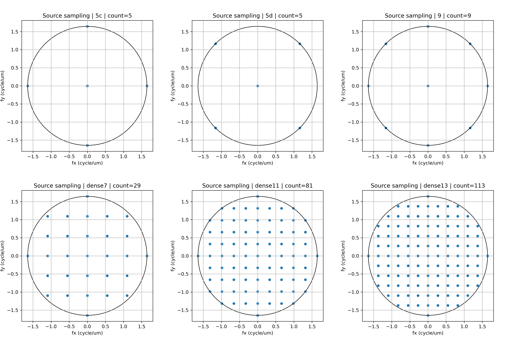

[English]({{ site.baseurl }}/method/) | [한국어]({{ site.baseurl }}/ko/method/)

# Method

## 1. Method Overview

이 페이지는 **GeoSignal Preview**에서 사용하는 계산 흐름과 해석 방식을 설명합니다.

GeoSignal Preview는 production-level lithography simulator나 calibrated wafer prediction model을 목표로 하지 않습니다.
대신 layout geometry에서 먼저 후보 영역을 찾고, 선택된 ROI에 대해 simplified optical model 기반 aerial image와 threshold contour를 생성하여, lithography-aware 관점에서 추가 검토가 필요한 형상을 빠르게 확인하는 preview workflow입니다.

핵심 구조는 다음과 같습니다.

```text
1차: layout geometry 기반 후보 영역 필터링
2차: 선택된 ROI에 대한 optical response 및 contour behavior 검토
```

즉, GeoSignal Preview의 method는 다음 질문을 다룹니다.

> geometry 기준으로 먼저 의심되는 위치를 찾고, 그 위치를 optical contour 관점에서 빠르게 확인할 수 있는가?

GeoSignal Preview의 기본 method flow는 다음과 같습니다.

```text
Layout Geometry
    → Geometry-based Candidate Filtering
    → ROI Selection
    → ROI Rasterization
    → Abbe-based Aerial Image Calculation
    → Multi-threshold Contour Extraction
    → Hotspot-like Shape Review
```

전체 흐름은 크게 두 부분으로 나눌 수 있습니다.

첫 번째는 **geometry 기반 1차 후보 필터링**입니다.

```text
Layout Geometry
    → Width / Space screening
    → Candidate ROI selection
```

두 번째는 **선택된 ROI에 대한 optical contour review**입니다.

```text
Candidate ROI
    → Rasterized Mask
    → Aerial Image
    → Multi-threshold Contour
    → Hotspot-like Shape Review
```

이 방식은 모든 layout 영역에 대해 optical simulation을 수행하는 것이 아닙니다.
먼저 layout 상의 width / space 기준으로 취약할 가능성이 있는 영역을 좁힌 뒤, 제한된 ROI에 대해서만 optical model 기반 contour를 계산합니다.

이를 통해 계산량을 줄이면서도, 사람이 우선적으로 확인해야 할 lithography-aware review point를 빠르게 살펴볼 수 있습니다.

이 public preview repository에는 core implementation code가 포함되어 있지 않습니다.
이 페이지는 preview 결과를 이해하기 위한 계산 개념, workflow 구조, 해석 기준을 설명하는 것을 목적으로 합니다.

---

## 2. Candidate ROI Selection

첫 번째 단계는 layout geometry에서 후보 ROI를 선택하는 것입니다.

현재 demo에서는 minimum width / space 관점에서 후보 영역을 먼저 찾습니다.
즉, layout 상에서 width 또는 space가 특정 기준 이하인 영역을 1차 후보로 추출한 뒤, 그중 일부를 optical contour review 대상으로 선택합니다.

현재 preview demo에서는 다음과 같은 임시 기준을 사용했습니다.

```text
width 또는 space가 0.200 µm 이하인 영역
```

여기서 `0.200 µm` 기준은 공정 rule이나 calibrated hotspot threshold가 아닙니다.
현재 demo에서는 minimum width / space 기준을 알고 있다고 가정하고, 해당 기준 근처의 취약 가능성이 있는 영역을 먼저 찾아본다는 의미로 사용한 preview용 기준입니다.

후보 선택 방식 역시 최적화된 hotspot ranking logic은 아닙니다.
현재는 계산량을 고려하여 width 후보 2개, space 후보 2개를 선택했으며, 이는 전체 workflow를 보여주기 위한 pragmatic selection입니다.

따라서 이 단계는 다음과 같이 이해하는 것이 적절합니다.

```text
최종 hotspot 판정
    X

optical contour review를 위한 1차 geometry-based filtering
    O
```

향후에는 candidate selection logic을 다음 방향으로 개선할 수 있습니다.

* 단순 width / space 기준 외에 local pattern context 고려
* line-end, corner, jog, neighboring feature 고려
* density 또는 local interaction 관점 반영
* 인접 레이어와의 오버레이 관계 반영
* contour sensitivity 또는 mask-contour mismatch 기반 ranking 검토

현재 method에서 중요한 것은 후보 선정 기준 자체가 최적이라는 점이 아니라, **geometry 기반 후보를 먼저 좁힌 뒤 optical contour review로 연결하는 구조**입니다.

---

## 3. ROI Rasterization

Candidate ROI가 선택되면, 해당 ROI 내부의 layout polygon을 rasterized mask image로 변환합니다.

Rasterized mask에서는 layout polygon 내부와 외부를 다음과 같이 표현합니다.

```text
polygon 내부  → 1
polygon 외부  → 0
```

즉, layout geometry를 regular pixel grid 위의 binary mask로 변환하는 단계입니다.

```text
Layout polygons in ROI
    → Pixel grid
    → Binary mask image
```

Rasterized mask는 optical imaging calculation의 입력이 됩니다.

현재 preview에서는 mask를 PSM-aware mask model이 아니라 binary mask 기준으로 계산합니다.
이는 계산량, 구현 복잡도, preview 목적의 명확성을 고려한 선택입니다. 즉, 현재 public preview workflow에는 phase-shift mask 효과, attenuated mask transmission, 또는 더 상세한 mask stack 효과가 포함되어 있지 않습니다.

필요 시 향후에는 phase / attenuation-aware mask representation 또는 PSM-aware modeling 방향으로 확장할 수 있습니다.

Pixel size는 해상도와 계산량 사이의 trade-off를 결정합니다.
작은 pixel size는 layout detail을 더 잘 표현할 수 있지만, image array 크기와 FFT 기반 계산량을 증가시킵니다. 반대로 큰 pixel size는 runtime을 줄일 수 있지만, 작은 geometry detail을 잃을 수 있습니다.

ROI에는 후보 위치 주변의 margin이 포함될 수 있습니다.
이는 optical response가 후보 polygon 자체뿐 아니라 주변 layout structure의 영향도 받기 때문입니다.

따라서 rasterization 단계는 단순한 이미지 변환이 아니라, 이후 aerial image와 contour 결과를 해석하기 위한 기준 mask를 만드는 단계입니다.

---

## 4. Abbe-based Aerial Image Calculation

GeoSignal Preview는 현재 Abbe 기반 simplified imaging approach를 사용합니다.

Aerial image는 rasterized mask에 simplified optical imaging model을 적용하여 얻은 optical intensity map입니다.

이 이미지는 다음에 가깝습니다.

```text
optical response image
```

다음으로 해석하면 안 됩니다.

```text
final wafer contour
calibrated resist contour
production CD prediction
```

계산 흐름은 개념적으로 다음과 같습니다.

```text
Rasterized mask
    → Mask spectrum
    → Source point sampling
    → Shifted pupil filtering
    → Coherent image per source point
    → Partially coherent aerial image
```

조금 더 구체적으로는 다음 순서로 계산됩니다.

1. Rasterized mask를 frequency domain으로 변환합니다.
2. 각 source point에 대해 illumination direction에 맞춰 pupil position을 shift합니다.
3. Shifted pupil을 이용해 mask spectrum을 filtering합니다.
4. Filtered spectrum을 다시 image domain으로 변환합니다.
5. 해당 source point에 대한 coherent intensity image를 계산합니다.
6. 여러 source point에서 얻은 coherent intensity image를 누적하여 최종 aerial image를 구성합니다.

아래 이미지는 9-point source 조건에서의 Abbe-style aerial image 계산 흐름을 보여주는 debug example입니다.


아래 이미지는 더 dense한 source sampling 조건에서 동일한 계산 흐름을 확인한 예시입니다.


이러한 계산을 통해 aerial image에서는 다음과 같은 현상을 정성적으로 확인할 수 있습니다.

* edge blur
* corner rounding-like response
* line-end pullback-like response
* narrow region 주변 intensity degradation
* neighboring pattern 간 optical interaction
* dense / isolated structure 간 response 차이

현재 preview 단계에서는 물리적 해석 가능성, 구현 복잡도, 계산량 사이의 균형을 고려하여 Abbe 기반 simplified calculation을 사용합니다.

---

## 5. Source Sampling and Pupil Filtering

Illumination source는 여러 source point를 sampling하여 근사합니다.

각 source point는 하나의 illumination direction을 의미합니다.
각 source point에 대해 pupil이 frequency domain에서 shift되고, 해당 pupil을 통과하는 spatial frequency component만 image reconstruction에 사용됩니다.

개념적으로는 다음과 같습니다.

```text
Source point
    → Shifted pupil
    → Filtered mask spectrum
    → Coherent image contribution
```

최종 aerial image는 sampling된 모든 source point의 image contribution을 누적하여 얻습니다.

Source point 수를 늘리면 illumination approximation이 더 부드러워질 수 있지만, 계산 시간이 증가합니다.
반대로 source point 수를 줄이면 runtime은 감소하지만, 결과가 sampling condition에 더 민감해질 수 있습니다.

아래 이미지는 source sampling 조건을 비교한 예시입니다.



아래 이미지는 source sampling 조건에 따라 aerial image 및 contour 결과가 어떻게 달라질 수 있는지 보여주는 비교 예시입니다.


현재 preview에서는 visual stability와 computational cost를 함께 고려하여 source sampling condition을 선택합니다.

향후에는 source 고도화, 더 많은 source point 사용, 계산 효율화를 위한 TCC 적용 등을 검토할 수 있습니다.

현재 결과는 scanner-calibrated lithography model이 아니라, qualitative optical-response visualization으로 해석해야 합니다.

---

## 6. Multi-threshold Contour Extraction

Aerial image가 계산되면, intensity image에서 threshold contour를 추출합니다.

Threshold contour는 aerial image intensity가 특정 threshold level을 지나는 위치를 연결한 contour입니다.

```text
Aerial image
    → Intensity threshold
    → Threshold contour
```

GeoSignal Preview에서 threshold contour는 printed-shape-like visual indicator로 사용됩니다.
즉, calibrated resist contour가 아닙니다.

현재 demo에서는 다음과 같은 multiple threshold level을 비교합니다.

```text
0.20 / 0.30 / 0.40
```

이 threshold value는 qualitative comparison을 위한 값입니다.
Process-calibrated threshold나 wafer CD 기준으로 해석하면 안 됩니다.

Multi-threshold contour는 aerial image가 threshold level에 따라 어떤 contour behavior로 나타나는지 확인하는 데 사용됩니다.

특히 다음과 같은 현상을 확인하는 데 도움이 됩니다.

* threshold-dependent contour shift
* weak image contrast region
* necking-like behavior
* bridge-like behavior
* line-end pullback-like behavior
* corner rounding-like behavior
* contour movement가 큰 위치

Threshold level 변화에 따라 contour가 크게 이동한다면, 해당 영역은 optical response가 상대적으로 약하거나 불안정할 수 있습니다.
반대로 contour가 threshold 변화에도 비교적 안정적이라면, contour-behavior 관점에서 더 robust한 영역일 수 있습니다.

---

## 7. Hotspot-like Shape Review

마지막 단계는 hotspot-like shape review입니다.

이 단계에서는 geometry-based candidate selection과 contour-based optical-response review를 함께 고려합니다.

검토 대상은 다음과 같은 형상입니다.

* geometry screening에서 확인된 narrow width 또는 narrow space
* mask와 contour 사이의 visible mismatch
* threshold level 변화에 따른 큰 contour movement
* narrow gap 주변의 bridge-like response
* narrow line 주변의 necking 또는 pinch-like response
* line-end pullback-like response
* corner rounding-like response

이 단계의 출력은 final pass/fail result가 아닙니다.
대신 추가 검토가 필요한 위치를 빠르게 파악하기 위한 visual guide입니다.

```text
Geometry candidate
    + Aerial image behavior
    + Threshold contour behavior
    → Lithography-aware review point
```

현재 preview 단계에서 hotspot-like shape는 confirmed lithography failure가 아니라 review candidate로 해석해야 합니다.

GeoSignal Preview의 철학은 다음에 가깝습니다.

```text
geometry 기준 후보 추출
    → optical response 확인
    → contour behavior 확인
    → 공정 이슈 가능성이 있는 위치를 우선 검토
    → 필요 시 mask correction 또는 추가 simulation으로 연결
```

즉, 이 method는 hotspot을 최종 판정하기 위한 것이 아니라, 사람이 먼저 확인해야 할 위치를 빠르게 좁혀주는 lightweight review workflow입니다.

---

## 8. Current Scope and Limitations

GeoSignal Preview는 현재 public preview 목적의 정성적 시각화 workflow입니다.

다음과 같은 가정과 한계를 가집니다.

* Public preview repository에는 core implementation code가 포함되어 있지 않습니다.
* Candidate selection logic은 최적화된 hotspot ranking이 아닙니다.
* 현재 demo의 `0.200 µm` 기준은 preview용 임의 기준입니다.
* Mask는 binary mask 기준으로 계산되며, PSM-aware mask modeling은 포함되어 있지 않습니다.
* Imaging model은 simplified Abbe-based model입니다.
* Wafer data 기반 calibration은 포함되어 있지 않습니다.
* Resist model과 etch model은 포함되어 있지 않습니다.
* Threshold contour는 qualitative visual indicator입니다.
* 현재 결과는 production CD prediction 용도로 사용하면 안 됩니다.
* Optical parameter는 preview 및 학습 목적에 맞게 단순화되어 있습니다.
* Public 또는 synthetic layout example을 사용합니다.
* Optical analysis는 주로 ROI level에서 수행됩니다.
* Source sampling은 runtime과 implementation complexity를 함께 고려하여 선택됩니다.

따라서 현재 method는 다음에 가깝습니다.

```text
layout-to-optical-response visualization
```

다음으로 해석하면 안 됩니다.

```text
production lithography verification
```

핵심 목표는 geometry-based candidate가 optical response 및 contour behavior 관점에서 어떻게 보이는지 이해할 수 있도록 돕는 것입니다.

---

## 9. Relation to Demo Page

Demo page는 이 method를 통해 생성된 visual output을 보여줍니다.

Method page는 해당 output이 어떤 계산 흐름으로 생성되며, 어떻게 해석해야 하는지 설명합니다.

| Demo Output              | Method Step                         |
| ------------------------ | ----------------------------------- |
| Geometry-based candidate | Candidate ROI Selection             |
| Rasterized mask          | ROI Rasterization                   |
| Aerial image             | Abbe-based Aerial Image Calculation |
| Multi-threshold contour  | Multi-threshold Contour Extraction  |
| Hotspot-like annotation  | Hotspot-like Shape Review           |

추천 reading order는 다음과 같습니다.

1. Demo page에서 visual flow를 먼저 확인합니다.
2. Method page에서 calculation flow를 이해합니다.
3. 추가적인 optical background가 필요하면 Technical Notes를 확인합니다.

---

## 10. Future Work

향후에는 다음 방향으로 개선할 수 있습니다.

| 항목                             | 방향                                                                                          |
| ------------------------------ | ------------------------------------------------------------------------------------------- |
| Candidate selection            | 단순 width / space 기준을 넘어 pattern context, line-end, corner, density, neighboring feature를 고려 |
| Ranking logic                  | 면적 기준이 아닌 contour sensitivity, mask-contour mismatch, local contrast 등을 반영                  |
| Runtime improvement            | 더 넓은 layout 영역을 다루기 위한 계산 최적화                                                               |
| Accuracy / imaging improvement | source 고도화, 더 많은 source point 사용, 계산 효율화를 위한 TCC 적용 검토 등                                    |
| Mask representation            | 필요 시 phase / attenuation-aware 또는 PSM-aware mask representation 검토                          |
| Mask optimization              | contour 결과를 바탕으로 간단한 mask correction 또는 rule-based adjustment 검토                            |
| Layer-aware review             | 인접 레이어와의 오버레이 관계 검토                                                                         |
| Additional examples            | dense line-space, isolated line-end, narrow gap, corner pattern 등 case 확장                   |
| Technical notes                | Fourier optics, Abbe imaging, contour interpretation 관련 설명 추가                               |

현재 우선순위는 public preview를 이해하기 쉽고, 시각적으로 유용하며, 기술적으로 과장되지 않고, 외부 의견을 받기 쉬운 형태로 유지하는 것입니다.

GeoSignal Preview는 demo result, technical review, external feedback을 기반으로 단계적으로 개선될 예정입니다.
