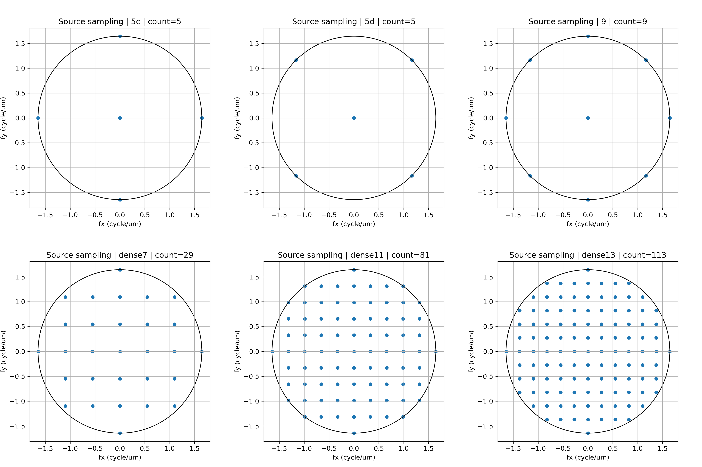

[English]({{ site.baseurl }}/method/) | [한국어]({{ site.baseurl }}/ko/method/)

# Method

## 1. Method Overview

이 페이지는 **GeoSignal Preview**에서 사용하는 계산 흐름과 해석 방식을 설명합니다.

GeoSignal Preview는 production-level lithography simulator나 calibrated wafer prediction model을 목표로 하지 않습니다. 대신 layout geometry에서 먼저 후보 영역을 찾고, 선택된 ROI에 대해 simplified optical model 기반 aerial image와 threshold contour를 생성하여 lithography-aware 관점의 형상 변화를 빠르게 확인하는 preview workflow입니다.

기본 method flow는 다음과 같습니다.

```text
Layout Geometry
    -> Geometry-based Candidate Filtering
    -> ROI Selection
    -> ROI Rasterization
    -> Abbe-based Aerial Image Calculation
    -> Multi-threshold Contour Extraction
    -> Hotspot-like Shape Review
```

모든 layout 영역에 대해 optical simulation을 수행하는 것이 아니라, geometry 기준으로 후보를 먼저 좁힌 뒤 선택된 ROI에 대해서만 optical-response visualization을 계산합니다.

버전별 구현 세부 내용은 [Release Notes]({{ '/release-notes/' | relative_url }})로 분리했습니다.

---

## 2. Candidate ROI Selection

첫 번째 단계는 layout geometry에서 후보 ROI를 선택하는 것입니다.

현재 demo에서는 minimum width / space 관점에서 후보 영역을 먼저 찾고, 그중 일부를 optical contour review 대상으로 선택합니다.

이 단계는 다음과 같이 이해하는 것이 적절합니다.

```text
최종 hotspot 판정
    X

optical contour review를 위한 1차 geometry-based filtering
    O
```

중요한 것은 후보 선정 기준 자체가 최적이라는 점이 아니라, **geometry 기반 후보를 먼저 좁힌 뒤 optical contour review로 연결하는 구조**입니다.

구체적인 threshold, ordering heuristic, backend 변경, benchmark 결과는 [v0.5]({{ '/release-notes/v0.5/' | relative_url }}) 및 [v0.6]({{ '/release-notes/v0.6/' | relative_url }}) release notes에 정리했습니다.

---

## 3. ROI Rasterization

Candidate ROI가 선택되면, 해당 ROI 내부의 layout polygon을 rasterized mask image로 변환합니다.

```text
polygon 내부  -> 1
polygon 외부  -> 0
```

즉, layout geometry를 regular pixel grid 위의 binary mask로 변환하는 단계입니다.

```text
Layout polygons in ROI
    -> Pixel grid
    -> Binary mask image
```

Rasterized mask는 optical imaging calculation의 입력이 됩니다.

현재 preview에서는 mask를 PSM-aware mask model이 아니라 binary mask 기준으로 계산합니다. Phase-shift mask 효과, attenuated mask transmission, 상세 mask stack 효과는 포함하지 않습니다.

Pixel size는 해상도와 계산량 사이의 trade-off를 결정합니다. ROI에는 후보 위치 주변 margin이 포함될 수 있으며, 이는 optical response가 주변 layout structure의 영향도 받기 때문입니다.

---

## 4. Abbe-based Aerial Image Calculation

GeoSignal Preview는 현재 Abbe 기반 simplified imaging approach를 사용합니다.

Aerial image는 rasterized mask에 simplified optical imaging model을 적용하여 얻은 optical intensity map입니다.

이 이미지는 다음에 가깝습니다.

```text
optical response image
```

다음으로 해석하면 안 됩니다.

```text
final wafer contour
calibrated resist contour
production CD prediction
```

계산 흐름은 개념적으로 다음과 같습니다.

```text
Rasterized mask
    -> Mask spectrum
    -> Source point sampling
    -> Shifted pupil filtering
    -> Coherent image per source point
    -> Partially coherent aerial image
```

아래 이미지는 9-point source 조건에서 Abbe-style aerial image 계산 흐름을 보여주는 debug example입니다.


아래 이미지는 더 dense한 source sampling 조건에서 동일한 계산 흐름을 확인한 예시입니다.


이 이미지는 method 이해를 위한 visual reference이며, calibrated scanner-model validation은 아닙니다.

Aerial image에서는 edge blur, corner-rounding-like response, line-end-pullback-like response, narrow region 주변 intensity degradation, neighboring pattern 간 optical interaction 등을 정성적으로 확인할 수 있습니다.

---

## 5. Source Sampling and Pupil Filtering

Illumination source는 여러 source point를 sampling하는 방식으로 근사합니다.

각 source point는 하나의 illumination direction을 나타냅니다. 각 source point에 대해 pupil을 frequency domain에서 shift하고, shifted pupil을 통과하는 spatial-frequency component만 사용해 image contribution을 재구성합니다.

```text
Source point
    -> Shifted pupil
    -> Filtered mask spectrum
    -> Coherent image contribution
```

Source point가 많아지면 illumination approximation은 더 부드러워질 수 있지만 계산 시간이 증가합니다. Source point가 적으면 runtime은 줄지만 sampling condition에 더 민감해질 수 있습니다.

아래 이미지는 source-sampling condition을 비교합니다.



아래 이미지는 source-sampling condition에 따라 aerial-image와 contour behavior가 어떻게 달라질 수 있는지 비교합니다.


현재 preview에서는 visual stability와 computational cost를 함께 고려해 source-sampling condition을 선택합니다. 최근 default 선택의 상세 근거는 release notes에 정리했습니다.

---

## 6. Multi-threshold Contour Extraction

Aerial image가 계산되면 intensity image에서 threshold contour를 추출합니다.

```text
Aerial image
    -> Intensity threshold
    -> Threshold contour
```

GeoSignal Preview에서 threshold contour는 printed-shape-like visual indicator입니다. Calibrated resist contour가 아닙니다.

현재 demo는 주로 다음 threshold level을 비교합니다.

```text
0.20 / 0.30 / 0.40
```

Multi-threshold contour 비교는 threshold-dependent contour shift, weak image-contrast region, necking-like behavior, bridge-like behavior, line-end-pullback-like behavior, corner-rounding-like behavior를 확인하는 데 도움이 됩니다.

Metric 구현 변경과 convergence check는 [v0.6 Release Notes]({{ '/release-notes/v0.6/' | relative_url }})에 정리했습니다.

---

## 7. Hotspot-like Shape Review

마지막 단계는 hotspot-like shape review입니다.

이 단계는 geometry-based candidate selection과 contour-based optical-response review를 결합합니다.

주요 신호는 다음과 같습니다.

* geometry screening으로 확인한 narrow width 또는 narrow space
* mask와 contour 사이의 visible mismatch
* threshold level에 따른 큰 contour movement
* narrow gap 주변 bridge-like response
* narrow line 주변 necking 또는 pinch-like response
* line-end-pullback-like response
* corner-rounding-like response

결과는 final pass/fail이 아니라 추가 검토할 위치를 빠르게 찾기 위한 visual guide입니다.

---

## 8. Current Scope and Limitations

* public preview repository에는 core implementation code가 포함되어 있지 않습니다.
* candidate-selection logic은 optimized hotspot-ranking method가 아닙니다.
* mask는 binary mask로 취급하며 PSM-aware mask modeling은 포함하지 않습니다.
* imaging model은 simplified Abbe-based model입니다.
* wafer-data calibration, resist model, etch model은 포함하지 않습니다.
* threshold contour는 qualitative visual indicator입니다.
* 결과는 production CD prediction에 사용하면 안 됩니다.
* optical analysis는 주로 ROI level에서 수행됩니다.

---

## 9. Related Pages

* [Home]({{ '/ko/' | relative_url }})
* [Demo]({{ '/ko/demo/' | relative_url }})
* [Technical Notes]({{ '/notes/' | relative_url }})
* [Release Notes]({{ '/release-notes/' | relative_url }})
